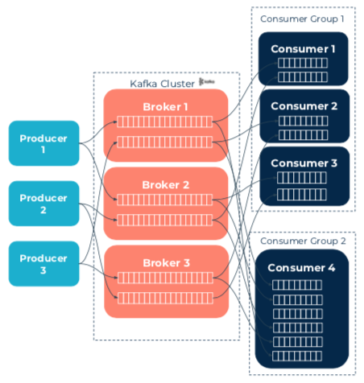
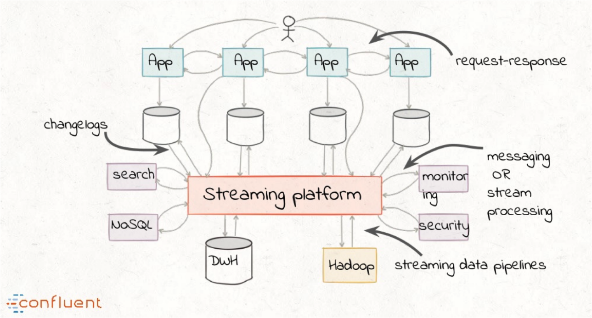

# Amazon Managed Streaming for Kafka (MSK)

## Authors

René Gómez Londoño - Ivan Salfati

## Table Of Contents

[Introduction](#introduction)

[Stream Processing](#stream-processing)

[Apache Kafka](#apache-kafka)

[Architecture](#architecture)

[Amazon Managed Streaming for Kafka](#amazon-managed-streaming-for-kafka)

[Conclusion](#Conclusion)

## Introduction

Digitization and the web 2.0 has lead to multiple data sources with structured and unstructured data. But the problem does not stop there, we have also created different specialized tools to store, query and analyse such data. The combination of more data sources and the need to get this data into diverse systems leads to a huge data integration problem. From the architectural point of view, the rise of event data have forced to change from _monolithic_ applications to more scalable systems with _Services Oriented Architectures_ (SOA) and more recently _Microservices_. 

When systems reach a critical level of dynamism we have to change the way of model and design the applications. However, this also increase the complexity of the communication systems required to properly transport data from the different sources to the multiple target systems. Companies easily end up building webs of micro-services, which are difficult to manage, debug and maintain.

The appropriate systems architecture for this inherent dynamic nature of complex engineered systems is the event driven architecture, built around the production, detection, and reaction to events that take place in time. 

The aim of stream processing platforms as Apache Kafka is precisely provide the capacities to process events in _real time_. Furthermore, since Big Data applications are deployed on the cloud it is also important to study how to deploy Kafka in such infrastructures. 

In this document, we explore some concepts behind stream processing, Apache Kafka and the cloud computing services provided to manage Kafka clusters in the Amazon cloud computing platform. We also present the typical architecture for Kafka solutions, the data abstraction and its importance in the whole Kafka’s ecosystem. At the end of the document we present the use cases and some real production architectures that evidence Kafka’s performance in companies like Twitter and Uber.

## Stream Processing

### Event centric design 
More than data stores, a company is an active process, continuously reacting and operating as events occur. In consequence, event centric design have emerged and with it event driven architectures, a design pattern built around the production, detection, and reaction to events that take place in real time ([Fowler 2017](#fowler-2017)). Companies are rethinking their business as a stream of events and how to respond to those events. This perspective lets companies to model what happens in their business as events: the sales, the orders, the customer experience and behavior are streams of events that again, model the operation of the business. They key is to detect such events, find relations between them and react in a proper manner. 

### Stream processing platform

Data stores somehow are based on the illusion of static data, using tables as the data abstraction. The *purpose of streaming platforms is to model change explicitly*, thinking in data flows and using a log as data abstraction. The following visualization made by [Alooma](https://www.alooma.com) represents the idea of data stream:

Both situations, data integration and events processing require new technological solutions. The data generated continuously by thousands of data sources that send data records simultaneously is called **streaming data** ([AWS 2018](aws-2018)). The ability to process/react in real time to messages/events is called **stream processing**. 

## Apache Kafka

Kafka is a distributing stream processing platform. Kafka got its start as an internal infrastructure system at LinkedIn. According to Jay Kreps ([Narkhede et al. 2017](narkhede-2017)) 

> Kafka tries to solve the problems related with handling _continuous flows of data_. 

For this reason, Kafka clusters are part of the data processing architecture of  a lot of companies like LinkedIn, Yahoo!, Twitter, Netflix, Spotify, Uber and many more.

### Understanding Kafka

In Kafka, the data records are know as messages and they are categorized into **topics**. Think of **messages** as the data _records_ and **topics** as a database **table**. 
 
Topics are additionally broken down into a number of **partitions** to be stored in a single **log**. This means messages are written down in partitions in an **append-only** fashion, and are read in order from beginning to end by **consumers**. 
Topics are divided into partitions to allow distribution across multiple servers if it is required. This provides redundancy and scalability. 

As was mentioned, Kafka uses a producer/consumer pattern. Kafka allows application **subscription** to one or more topics to store/process/react to the stream of records produced to them. Each client has its own **offset**, which is a pointer to the next message the consumer has to process. With the offset a consumer can stop and restart the process (or fail) without losing its place. This is why Kafka allows different types of applications to integrate to a single source of data. The data can be processed at different rates by each consumer. 

Another important concept in Kafka is the **consumer groups**, which are nothing more than consumers working together to process a topic. It allows to add scale processing of data in Kafka.

All these concepts and the way the are related is the reason why at the beginning Kafka was considered a distributed commit log. However, the API for processing the streams was later added and with it, Kafka became a streaming processing platform. These different concepts are illustrated in the following figure:

### Architecture
Kafka defines different APIs to decoupling the capabilities it provides.

- **Producer API:** The producer API allows applications to send streams of data to topics in the Kafka cluster.
- **Consumer API:** The Connect API allows applications to read streams of data from topics in the Kafka cluster.
- **Connect API:** The consumer API allows implementing connectors that continually pull from some source data system into Kafka or push from Kafka into some sink data system.
- **Streams API:** The Streams API allows transforming streams of data from input topics to output topics. Using the API is possible to transform, aggregate and derive new data.
- **AdminClient API:** The AdminClient API supports managing and inspecting topics, brokers, ACLs, and other Kafka objects.

Putting all together, this is how the main components are connected: 

Source: [Sabri Skhiri, Euranova](https://euranova.eu)

Going back to the microservice system explored at the beginning of this document, the following figure represents the same system orchestrated using Kafka as streaming platform:

 The ability to decouple producers and consumers using an event log as an intermediate layer allows the [service choreography](https://en.wikipedia.org/wiki/Service_choreography):

> "Dancers dance following a global scenario without a single point of control"

With this architecture many components can subscribe to events stored in the event log and react to them asynchronously. 

At this point, it is important to remember the communication patterns involved in Kafka. Notice  that a **message queue** allows  to **scale processing** of data over multiple consumer’s instances that process the data. Unfortunately, once a message is consumed from the queue the message is not available anymore for others consumers that may be interested in the same message. **Publisher/subscriber** in contrast **does not scale processing** but it allows you to **broadcast each message** to a list of subscribers, enabling the capacity to connect new client applications to the same data source. 

Kafka offers a mix of those two messaging models: **Kafka** publishes messages in topics that **broadcast** all the **messages to** different **consumer groups**. The **consumer group acts** as a **message queue** that **divides** up **processing** over all the members of a group. 

### Use cases

##### ___ TODO: Link examples of real applications for each case____ [Done]

Kafka is being used in many different application domains. Here are some of them:

- **Real-time web and log analytics:** How the web application performs and how the users interact with it, e.g.: [Sematext](https://sematext.com/)
- **Messaging:** Some companies use Kafka as a buffer to communicate different applications, e.g.: [Helprace](https://helprace.com/help-desk) 
- **Transaction and event sourcing:** Gathering transactions from multiple data sources to maintain the consistency and traceability of such transactions, i.e.: [Confluent](https://www.confluent.io/blog/event-sourcing-cqrs-stream-processing-apache-kafka-whats-connection/)
- **Decoupled microservices:** Popular data store for micro services, e.g.: [Event Streams for IBM Cloud](https://www.ibm.com/cloud/event-streams-for-cloud)
- **Streaming ETL:** Ingest and transform data to deliver info to other systems in _real time_, e.g.: [Spongecell](https://www.spongecell.com/about) 

Some companies using Kafka: 

##### ___ TODO: Redact the use cases____

If possible, include different companies with different architectures

## Amazon Managed Streaming for Kafka

### Introduction
Amazon MSK is a fully managed service that makes it easy for you to build and run applications that use Apache Kafka to process streaming data ([MSK Documentation](https://docs.aws.amazon.com/msk/latest/developerguide/what-is-msk.html))

The following diagram provides an overview of how Amazon MSK works and one of the typical architectures:

### Benefits
The advantage of MSK is having all the capacities of Kafka integrated and managed as the other Amazon Web Services. It is then possible to use the AWS Command Line Interface ([AWS CLI](https://aws.amazon.com/cli/)) or the APIs in the SDK to perform control-plane operations. For example, you can use the AWS CLI or the SDK to create or delete an Amazon MSK cluster, list all the clusters in an account, or view the properties of a cluster.

MSK promise the advantages that are in general offer by Amazon's cloud computing services: 
> Amazon Managed Streaming for Kafka **makes it easy** for you to **build and run production applications on Apache Kafka without needing** Apache Kafka infrastructure **management expertise**. That means you spend less time managing infrastructure and more time building applications.

### Creating a Kafka cluster with MSK

The main advantage of MSK is the facility it provides to configure and operate Kafka. You can verify it following the _getting started_ in the [official documentation](https://docs.aws.amazon.com/msk/latest/developerguide/what-is-msk.html). Basically, you must consider the following steps: 

1. **Create a VPC** - First you configure a logically isolated section of Amazon Web Services Cloud creating a Virtual Private Cloud.
2. **Enable High Availability and Fault Tolerance** - Here you specify subnets  in different availability zones in order to have high availability and increase fault tolerance
3. **Create a Cluster** Then, using a configuration file you create the cluster in the network built in step 2.
4. **Create a Client Machine** - Now you can configure the client to access the cluster. You will have to configure the proper security groups so the cluster accept info originated in the client machine.
5. **Create a Topic** - From the client machine you access the cluster to manage topics, partitions, replication, etc.
6. **Produce and Consume Data** - Finally, you use the APIs to produce and consume data from the cluster. Here is the example of following the mentioned tutorial:

From this point, you can configure your cluster to integrate other services of AWS like DynamoDB and so on.

When creating and configuring the Kafka cluster it is recommended to be really careful while copying the IDs of the different components. In the same way, make sure to set the security groups correctly, most error come from not having the client machine as a safe source of information in the Kafka.

## Best practices

##### ___ TODO: Redact the best practices____

Review the following and get some other sources to get best practices and useful advices for application deployment using MSK

https://aws.amazon.com/blogs/big-data/best-practices-for-running-apache-kafka-on-aws/

Review webinar

https://pages.awscloud.com/Introduction-to-Amazon-Managed-Streaming-for-Kafka-MSK_1208-ABD_OD.html

 
## Conclusion

##### ___ TODO: Redact conclusions____

In this report we have described the foundations of Kafka and MSK architecture.. 

## Sources and further readings

[Fowler 2017](https://link.io/)
